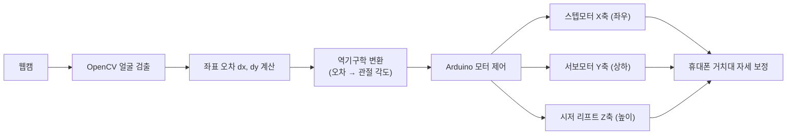
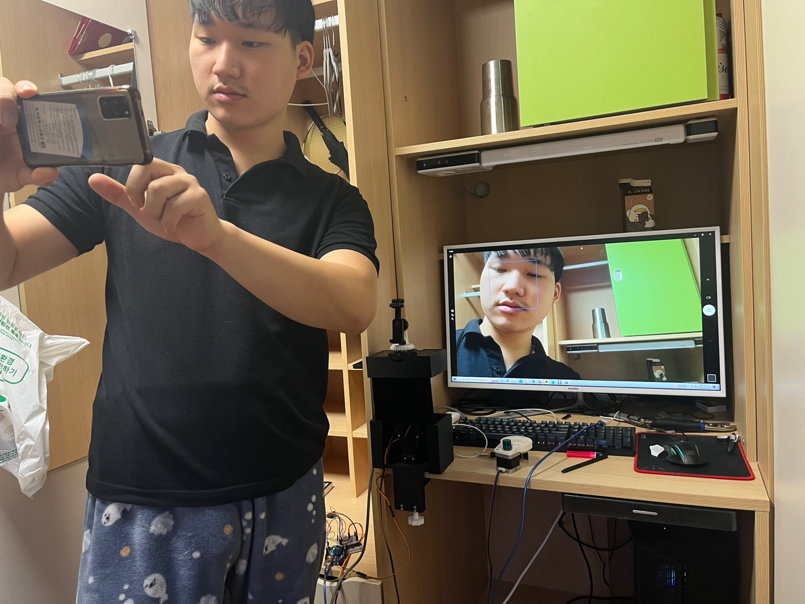
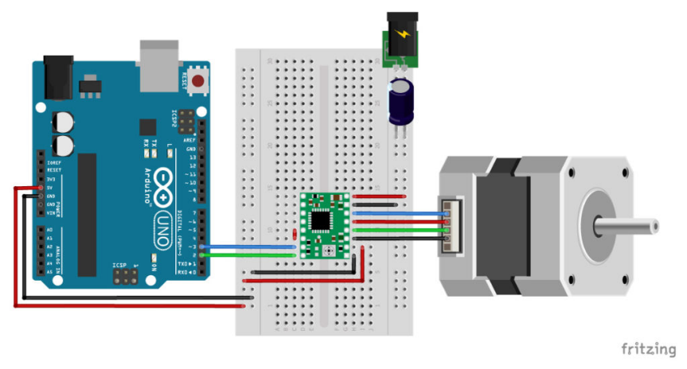
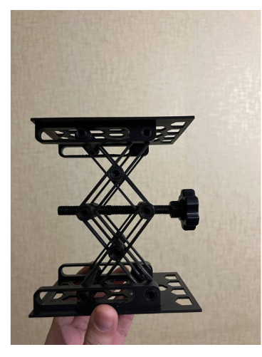
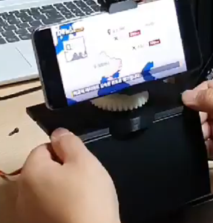
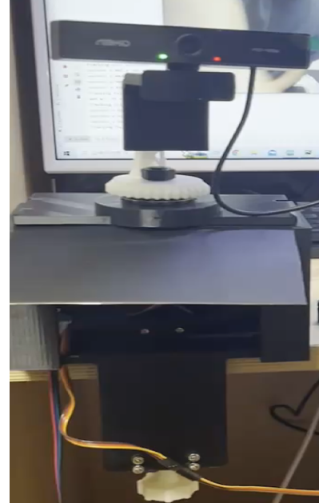

# 얼굴 추적 자동 휴대폰 거치대 (Face Tracking Phone Holder)
> 사용자의 얼굴 위치를 실시간 추적해 휴대폰 화면이 항상 정면을 향하도록 자동 구동하는 2축 거치대 로봇 (응용기계설계 기말작품)

## 📌 프로젝트 정보
| 항목 | 내용 |
|------|------|
| 개발 기간 | 2023.11.02 ~ 2023.11.20 |
| 팀 구성 | 4인 팀 프로젝트 (응용기계설계 기말작품 · 3조 Face Tracker) |
| 담당 역할 | **회로 설계·연결 / 역기구학 설계 / 기구부 제작 보조 / PPT 제작** |
| 시연 영상 | [YouTube](https://youtu.be/vMFg_ck-BE8) |

## 🎯 프로젝트 개요
누워서 또는 편한 자세로 휴대폰·태블릿을 사용할 때, 자세를 바꿀 때마다 거치대 위치를 직접 옮겨야 하는 불편함에서 출발한 프로젝트입니다. 웹캠으로 사용자의 얼굴을 실시간 검출하고, 화면 중심과의 좌표 오차(dx, dy)를 계산해 거치대가 자동으로 휴대폰의 방향을 보정하는 "거치대 + Tracking + 로봇"을 구현했습니다. X축(스텝모터)으로 좌우 회전, Y축(서보모터)으로 상하 틸트를 보정하고, 시저 리프트로 Z축 높이를 제어합니다.

## ✨ 주요 기능 / 담당 업무
- **회로 설계 및 연결**: Arduino + A4988 스텝모터 드라이버 + 스텝모터/서보모터를 잇는 구동 회로를 설계하고 직접 결선했습니다. (전원·GND 정리, Step/Dir 핀 배선)
- **역기구학 설계**: 웹캠이 검출한 얼굴 좌표 오차(dx, dy)를 거치대 각 축(X 좌우 회전·Y 상하 틸트)의 목표 관절 제어량으로 변환하는 역기구학 관계식을 분석·설계했습니다. (추적 시 각 모터가 얼마나 움직여야 하는지를 정의)
- **기구부 제작 보조**: 시저 리프트(Z축 높이 제어), 시저 리프트–스텝모터 결합, 평기어 동력 전달, 클램프 고정 구조 등 기구부 제작을 보조했습니다.
- **PPT 제작**: 발표 자료를 제작했습니다.

> 참고(팀 역할 분담): **Tracking 프로그램(코드)·Bluetooth 앱 개발·하드웨어 전체 설계**는 팀원이 담당했습니다. 본인은 **회로·역기구학(설계)·기구부·발표**를 맡았습니다.

## 🛠 기술 스택
### 담당 (회로 · 역기구학 · 기구)
- Arduino + A4988 스텝모터 드라이버 구동 회로 (설계·결선)
- 역기구학 — 얼굴 좌표 오차 → 2축 관절 제어량 변환 (설계)
- 시저 리프트 · 평기어 · 클램프 기구부 (3D 프린팅)

### 프로젝트 전체
- Python (OpenCV 얼굴 추적) · 시리얼 통신
- MIT App Inventor · Bluetooth (모바일 앱)

## 🔀 시스템 아키텍처

웹캠으로 검출한 얼굴 좌표 오차를 **역기구학으로 각 축의 관절 제어량으로 변환**하고, 그 값을 Arduino가 받아 2축(+Z축 높이) 모터를 구동해 휴대폰이 항상 얼굴을 향하도록 자세를 보정합니다.

## 📐 역기구학 설계 (담당)
화면 중심과 얼굴 사이의 **픽셀 오차(dx, dy)를 그대로 모터 각도로 쓰면**, 카메라와의 거리·렌즈 화각에 따라 같은 각도라도 픽셀량이 달라져 과추적·소추적이 발생합니다. 그래서 **카메라 화각과 거치대 2축 링크 구조를 반영해 픽셀 오차를 각 축의 목표 관절 각도로 변환하는 역기구학 관계식**을 설계했습니다.
- **X축(좌우 회전)** — 스텝모터: 수평 픽셀 오차 dx → 좌우 회전 각도
- **Y축(상하 틸트)** — 서보모터: 수직 픽셀 오차 dy → 상하 틸트 각도
- 이렇게 제어량을 축별로 분리해, Tracking 프로그램이 산출한 오차를 실제 기구 동작으로 정확히 연결할 수 있도록 했습니다.

## 🔧 기술적 도전과 해결 (Technical Challenges)

### Q1. 픽셀 오차를 어떻게 실제 모터 각도로 변환할 것인가? (역기구학)
> **Challenge:** 얼굴이 화면에서 벗어난 픽셀량은 카메라와의 거리·화각에 따라, 같은 회전 각도라도 다르게 나타납니다. 픽셀 오차를 단순 비례로 모터에 주면 가까울 땐 과추적, 멀 땐 소추적이 발생했습니다.
> **Solution:** 카메라 화각과 거치대 2축 링크 구조를 반영한 역기구학 관계식을 설계해, 픽셀 오차(dx, dy)를 X(좌우)·Y(상하) 관절 각도로 변환했습니다. 축별로 제어량을 분리해 좌우는 스텝모터, 상하는 서보모터가 담당하도록 매핑함으로써 거리·화각이 달라져도 안정적으로 추적되도록 했습니다.

### Q2. 무거운 거치대의 Z축 높이를 어떻게 안정적으로 제어할 것인가? (기구)
> **Challenge:** 휴대폰 거치대를 위아래로 들어 올리려면 직접 구동만으로는 충분한 힘과 안정성을 확보하기 어려웠습니다.
> **Solution:** 시저 리프트 구조로 Z축 전체 높이를 제어하고, 시저 리프트와 스텝모터를 결합한 뒤 평기어로 동력을 전달하도록 설계했습니다. 거치대는 클램프로 고정해 구동 중 흔들림을 줄였습니다. (스펙시트 기준 Z축 최대 높이 26cm, 스텝 각 2°)

### Q3. 다축 모터를 한 보드로 구동하는 회로를 어떻게 구성했나? (회로)
> **Challenge:** 스텝모터(좌우)·서보모터(상하)·시저 리프트(높이)를 하나의 Arduino로 안정적으로 구동하는 회로를 결선해야 했고, 드라이버·모터 전원과 신호선이 섞이지 않게 정리해야 했습니다.
> **Solution:** A4988 드라이버를 통해 스텝모터의 Step/Dir 핀을 분리 배선하고, 모터 구동 전원과 로직 전원을 구분해 GND를 공통으로 묶었습니다. 회로를 직접 설계·결선해 Tracking 결과가 모터 구동까지 끊김 없이 전달되도록 했습니다.

## 📸 프로젝트 흐름 및 이미지 기록
> 얼굴 좌표를 모터 각도로 바꾸는 제어 흐름과, 실제로 제작한 회로·기구부가 함께 보이도록 구성했습니다.

| 화면 | 설명 |
|------|------|
|  | 거치대에 휴대폰을 장착하고 모니터에서 얼굴 검출 박스로 실시간 추적을 시연하는 모습 |
|  | 손에 든 3D 프린팅 시저 리프트 기구부 — 높이 조절 축의 실제 제작 결과 |
|  | Arduino UNO·브레드보드·A4988 드라이버·스텝모터 구동 회로 결선도 |
|  | 시저 리프트 상세 — Z축 높이 제어를 위한 기구 구조와 조립 상태 확인 |
|  | 얼굴 추적 데모 — 얼굴 중심 오차를 계산해 좌우/상하 모터 제어로 넘기는 테스트 화면 |
|  | 추적 제어 화면 — 얼굴 검출 결과와 모터 제어 상태를 함께 확인한 통합 테스트 장면 |

## 🎬 시연 영상

▶️ https://youtu.be/vMFg_ck-BE8
