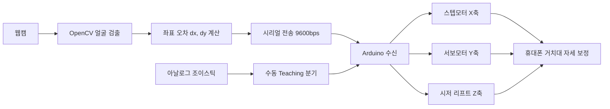

# 얼굴 추적 자동 휴대폰 거치대 (Face Tracking Phone Holder)
> 사용자의 얼굴 위치를 실시간 추적해 휴대폰 화면이 항상 정면을 향하도록 2축 자동 구동하는 거치대 로봇

## 📌 프로젝트 정보
| 항목 | 내용 |
|------|------|
| 개발 기간 | 2023.11.02 ~ 2023.11.20 |
| 팀 구성 | 3인 팀 프로젝트 |
| 담당 역할 | 회로 설계 / 수동 Teaching / 기구부 / 시리얼 통신 |
| 시연 영상 | 준비 중 |

## 🎯 프로젝트 개요
웹캠으로 사용자의 얼굴을 실시간 검출하고, 화면 중심과의 좌표 오차를 계산해 거치대가 자동으로 휴대폰의 방향을 보정하는 로봇입니다. X축(스텝모터)·Y축(서보모터)·Z축(시저 리프트)의 3축 기구부를 통해 화면이 항상 사용자 정면을 향하도록 구동합니다. 자동 추적 모드 외에 아날로그 조이스틱 기반 수동 Teaching 기능을 함께 구현하여, 사용자가 직접 각 축을 조작해 원하는 자세로 위치시킬 수 있도록 했습니다.

## ✨ 주요 기능 / 담당 업무
- **회로 설계**: 서보모터(Y축)와 스텝모터(X축) 구동을 위한 Arduino + A4988 드라이버 제어 회로를 설계하고 제작 전 과정을 보조했습니다.
- **조이스틱 수동 Teaching 구현**: 아날로그 조이스틱 3축(VRX/VRY/VRZ) 입력을 `analogRead`로 읽어 임계값(200/800)으로 정·역 방향을 판별하고, A4988의 Step/Dir 핀을 제어해 X·Y·Z 스텝모터를 독립적으로 구동하도록 구현했습니다.
- **기구부 설계·제작**: 시저 리프트, 평기어, 클램프 구조를 3D CAD로 설계한 뒤 3D 프린팅으로 제작·조립했습니다.
- **Python-Arduino 시리얼 통신**: 얼굴 좌표 오차(dx, dy)를 `X{dx}Y{dy}` 포맷으로 직렬화해 9600bps로 전송하고, 수신 값으로 서보 각도와 스텝모터 펄스를 실시간 제어했습니다.
- **역기구학 및 앱 개발 지원**: 역기구학 기반 FaceTracking 로직을 보조하고, MIT App Inventor 기반의 Bluetooth 웹캠 앱 개발을 지원했습니다.

## 🛠 기술 스택
### Software
- Python (OpenCV 얼굴 추적)
- Arduino (C++)
- 역기구학(Inverse Kinematics)
- MIT App Inventor

### Hardware
- 스텝모터 + A4988 드라이버 (X축)
- 서보모터 (Y축)
- 시저 리프트 (Z축)
- 아날로그 조이스틱
- Bluetooth 모듈
- 3D 프린팅 기구부

## 🔀 시스템 아키텍처

웹캠으로 검출한 얼굴 좌표 오차를 시리얼로 Arduino에 전달해 3축 모터를 구동하며, 조이스틱 입력은 수동 Teaching 경로로 분기되어 동일한 구동부를 제어합니다.

## 📸 스크린샷
> `images/` 폴더에 이미지를 추가한 뒤 아래 경로를 맞춰주세요.

| 화면 | 설명 |
|------|------|
|  | OpenCV 얼굴 검출 및 좌표 오차 추적 화면 |
|  | 3축 기구부(시저 리프트·스텝모터·서보모터) 동작 모습 |

## 🎬 시연 영상

