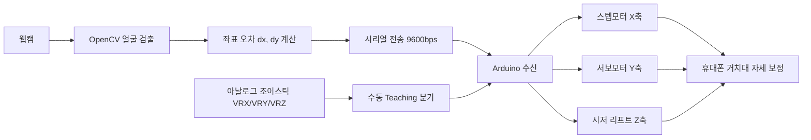

# 얼굴 추적 자동 휴대폰 거치대 (Face Tracking Phone Holder)
> 사용자의 얼굴 위치를 실시간 추적해 휴대폰 화면이 항상 정면을 향하도록 자동 구동하는 거치대 로봇


## 📌 프로젝트 정보
| 항목 | 내용 |
|------|------|
| 개발 기간 | 2023.11.02 ~ 2023.11.20 |
| 팀 구성 | 3인 팀 프로젝트 (응용기계설계 기말작품) |
| 담당 역할 | 회로 설계 / 전체 보조 / 조이스틱 수동 Teaching / 기구부 보조 / PPT 제작 |
| 시연 영상 | https://youtu.be/vMFg_ck-BE8 |

## 🎯 프로젝트 개요
누워서 또는 편한 자세로 휴대폰·태블릿을 사용할 때, 자세를 바꿀 때마다 거치대 위치를 직접 옮겨야 하는 불편함에서 출발한 프로젝트입니다. 웹캠으로 사용자의 얼굴을 실시간 검출하고, 화면 중심과의 좌표 오차(dx, dy)를 계산해 거치대가 자동으로 휴대폰의 방향을 보정하는 "거치대 + Tracking + 로봇"을 구현했습니다. X축(스텝모터)과 Y축(서보모터)으로 방향을 보정하고, 시저 리프트로 Z축 높이를 제어합니다. 자동 추적 외에 아날로그 조이스틱 기반 수동 Teaching 기능을 함께 구현하여, 사용자가 각 축을 직접 조작해 원하는 자세로 위치시킬 수 있도록 했습니다.

## ✨ 주요 기능 / 담당 업무
- **회로 설계 및 전체 보조**: 5V/GND 전원과 Arduino, A4988 드라이버, 모터(m1·m2)를 잇는 구동 회로를 설계하고, 아두이노–파이썬 시리얼 통신 기반 모터 제어로 Tracking이 동작하도록 회로 측면을 담당했습니다.
- **조이스틱 수동 Teaching (RobotArm teaching with joystick)**: 아날로그 조이스틱 3축(VRX/VRY/VRZ) 입력을 `analogRead`로 읽어 임계값(200/800)으로 정·역 방향을 판별하고, A4988의 Step/Dir 핀을 펄스 제어해 X·Y·Z 스텝모터를 독립적으로 구동하는 펌웨어를 작성했습니다.
- **기구부 설계·제작 보조**: 시저 리프트를 통한 Z축 제어, 시저 리프트–스텝모터 결합 및 평기어를 이용한 제어, 클램프 고정 구조 등 기구부 제작을 보조했습니다.
- **PPT 제작**: 발표 자료(PPT) 제작을 담당했습니다.

> 참고: 얼굴 추적 알고리즘(역기구학 기반 Tracking)과 하드웨어 전체 설계·앱 개발은 팀원이 담당했습니다.

## 🛠 기술 스택
### Software
- Python (OpenCV 얼굴 추적, 시리얼 통신)
- Arduino (C++)
- MIT App Inventor (MIT AI2 Companion)

### Hardware
- 스텝모터 + A4988 드라이버 (X축 / 조이스틱 Teaching의 X·Y·Z축)
- 서보모터 (Y축)
- 시저 리프트 + 평기어 (Z축)
- 아날로그 조이스틱 (VRX/VRY/VRZ)
- Bluetooth 모듈
- 3D 프린팅 기구부

## 🔀 시스템 아키텍처

웹캠으로 검출한 얼굴 좌표 오차를 시리얼로 Arduino에 전달해 3축 모터를 구동하며, 조이스틱 입력은 수동 Teaching 경로로 분기되어 동일한 구동부를 제어합니다.

## 💻 핵심 코드 (담당 역할)

### 1. 조이스틱 Teaching — 핀 정의 및 setup
A4988 CNC 회로 기준으로 X·Y·Z 3축의 Step/Dir 핀과 조이스틱 아날로그 입력(VRX/VRY/VRZ)을 정의하고 입출력 모드를 초기화합니다.

```cpp
const int XStepPin=2;    // X Step Pin
const int XDirPin=5;     // X Direction Pin
const int YStepPin=3;    // Y Step Pin
const int YDirPin=6;     // Y Direction Pin
const int ZStepPin=4;
const int ZDirPin=7;
int VRX=A0;
int VRY=A1;
int VRZ=A2;
int SW=12;

void setup() {
  Serial.begin(9600);
  pinMode(XStepPin,OUTPUT);
  pinMode(XDirPin,OUTPUT);
  pinMode(YStepPin,OUTPUT);
  pinMode(YDirPin,OUTPUT);
  pinMode(ZStepPin,OUTPUT);
  pinMode(ZDirPin,OUTPUT);
  pinMode(VRX,INPUT);
  pinMode(VRY,INPUT);
  pinMode(VRZ,INPUT);
  pinMode(SW,INPUT);
}
```

### 2. 조이스틱 Teaching — analogRead 임계값 기반 스텝모터 구동 (loop)
조이스틱 아날로그 값을 읽어 임계값(800 미만 / 200 초과)으로 정·역 방향을 판별하고, Dir 핀을 설정한 뒤 Step 핀에 펄스를 보내 해당 축 스텝모터를 회전시킵니다. (X축 예시, Y·Z축도 동일 패턴)

```cpp
void loop() {
  int Xvalue = analogRead(VRX);
  // ...Yvalue, Zvalue 동일하게 읽음

  if (Xvalue < 800) {
    digitalWrite(XDirPin, HIGH);          // 시계 방향
    digitalWrite(XStepPin, HIGH);         // 펄스 ON
    delayMicroseconds(500);
    digitalWrite(XStepPin, LOW);          // 펄스 OFF
    delayMicroseconds(500);
  }
  if (Xvalue > 200) {
    digitalWrite(XDirPin, LOW);           // 반시계 방향
    digitalWrite(XStepPin, HIGH);
    delayMicroseconds(500);
    digitalWrite(XStepPin, LOW);
    delayMicroseconds(500);
  }
  // Y축(VRY), Z축(VRZ)도 동일한 임계값/펄스 로직으로 제어
}
```

## 🔧 기술적 도전과 해결 (Technical Challenges)

### Q1. 조이스틱 입력으로 다축 스텝모터를 어떻게 직관적으로 수동 제어할 것인가?
> **Challenge:** 자동 추적과 별개로, 사용자가 각 축을 직접 움직여 원하는 자세를 잡는 수동 Teaching이 필요했습니다. 아날로그 조이스틱은 중립에서도 일정한 값이 들어와 미세한 떨림으로도 모터가 오작동할 수 있었습니다.
> **Solution:** 각 축의 `analogRead` 값을 임계값(800 미만 / 200 초과)으로 구간화해 중립 영역을 둔 뒤, 한쪽 방향은 Dir 핀 HIGH, 반대 방향은 LOW로 설정하고 Step 핀에 `delayMicroseconds(500)` 간격의 펄스를 인가했습니다. 동일 패턴을 X·Y·Z 3축에 독립 적용해 한 조이스틱으로 다축을 직관적으로 Teaching할 수 있도록 했습니다.

### Q2. 무거운 거치대의 Z축 높이를 어떻게 안정적으로 제어할 것인가?
> **Challenge:** 휴대폰 거치대를 위아래로 들어 올리려면 직접 구동만으로는 충분한 힘과 안정성을 확보하기 어려웠습니다.
> **Solution:** 시저 리프트 구조로 Z축 전체 높이를 제어하고, 시저 리프트와 스텝모터를 결합한 뒤 평기어로 동력을 전달하도록 설계했습니다. 거치대는 클램프로 고정해 구동 중 흔들림을 줄였습니다. (스펙시트 기준 Z축 최대 높이 26cm, Z축 스텝 각 2°)

### Q3. 파이썬 얼굴 추적 결과를 어떻게 아두이노 모터 제어로 연결할 것인가?
> **Challenge:** OpenCV로 계산한 얼굴 좌표 오차를 아두이노로 전달해 실시간으로 모터를 구동해야 했습니다.
> **Solution:** 파이썬에서 오차를 `X{dx}Y{dy}` 포맷 문자열로 직렬화해 9600bps 시리얼로 전송하고, 아두이노가 `'X'`/`'Y'` 헤더를 파싱해 `dx`, `dy`를 받아 X축(스텝모터)·Y축(서보모터)을 제어하도록 통신 규약을 맞춰 Tracking을 완성했습니다.

## 📸 스크린샷
> `images/` 폴더에 이미지를 추가한 뒤 아래 경로를 맞춰주세요.

| 화면 | 설명 |
|------|------|
|  | 3D 프린팅으로 완성한 하드웨어 및 웹캠 장착 테스트 모습 |
|  | 시저 리프트·스텝모터·평기어 결합 기구부 동작 모습 |
|  | A4988 기반 조이스틱 Teaching 회로 및 동작 |

## 🎬 시연 영상
[](https://youtu.be/vMFg_ck-BE8)

최종 영상: https://youtu.be/vMFg_ck-BE8
